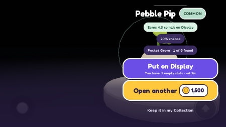
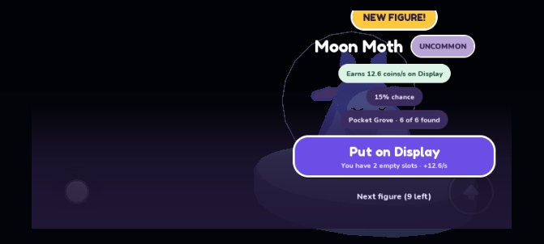
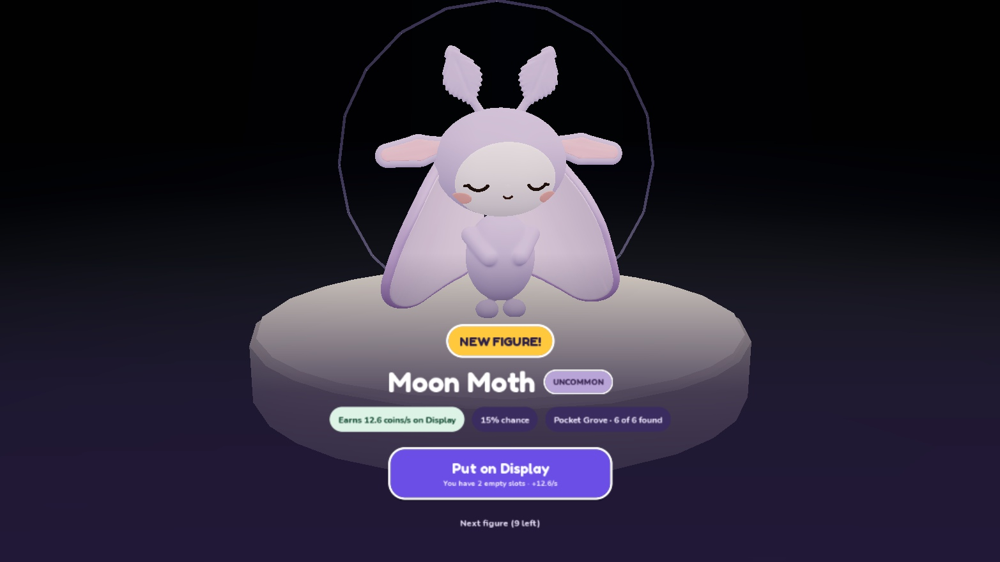
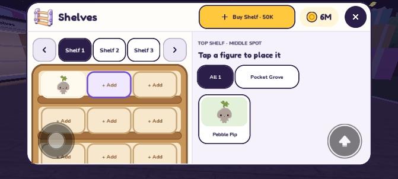
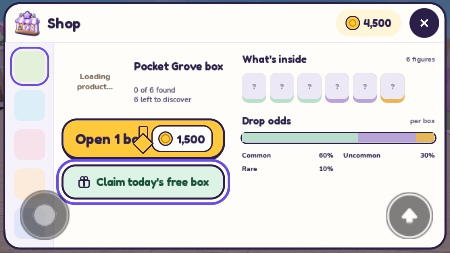

# Blind Box Full Game Audit

Date: 2026-10-04

Game/build/commit reviewed: Blind Box / Blindbox Town, `master` at `4733e1d` (merged soundpack, background music and volume settings). Fresh `RobloxWorkspace.rbxlx` built with pinned Rojo 7.7.0.

Testing environment: Windows Roblox Studio; disposable, unpublished local place (`PlaceId = 0`, `GameId = 0`), single player, `studioPersistence = false`. Desktop plus Studio device emulation. No live player data or published place was changed. This is an inspection report; no gameplay fixes were made.

## Executive Summary

**The core loop works and is substantially beyond a scaffolding prototype. It is not ready for an unrestricted public release yet.** A fresh player can claim a box, see an actual collectible, put it on Display, collect banked Coins, buy again, benefit from duplicates, decorate Shelves, expand the Display, claim rewards and return Home. Those actions were performed through the running game's controls, not inferred solely from code.

The strongest areas are the server-owned economy, separation of earning Display from cosmetic Shelves, distinctive collection packaging, readable desktop navigation, and the amount of existing regression coverage. The Grove models read as collectible toys. The current neutral Shop/world direction is coherent; a new physical shop building is not necessary to complete that direction.

The first few pulls and decorating provide an appealing short loop. This audit does **not** establish that several hours of progression are fun or that players will return. The weakest experience is the mobile reveal: the camera puts the figure underneath its result controls, and its lighting can become much darker than the same result on desktop. Onboarding can falsely decide that a player learned to collect income. Repeated openings and duplicate rewards also need clearer, less laborious presentation.

Desktop polish is uneven rather than absent. There is a consistent UI language, loaded audio, functioning camera restoration and useful feedback. Small-phone targets, short-height layouts, tutorial pointing, and some economy labels still need work. No confirmed P0 exploit or data-loss defect was found. That is **not** a persistence or multiplayer certification: real DataStore rejoin/session contention, two-client ownership/replication, physical touch, listening/mix quality, and a populated-server performance soak remain release gates.

This feels like a credible first-public-version candidate after a focused mobile/FTUE pass and completion of those gates. A backend rewrite or a large new feature roadmap would be the wrong next step.

### Evidence and interpretation

| Label | Meaning |
| --- | --- |
| Native play | Actual Studio client keyboard/mouse interaction with the current game. Phone emulation still used automated mouse input; it is not a physical-touch test. |
| Native fixture | Real Roblox rendering/lifecycle using existing modules, with controlled preview inputs. No claim that the figure was earned naturally. |
| Automated | Existing repository regression suites, including mock storage and adversarial domain inputs. |
| Source | Inspection of implementation/configuration. |
| Unverified | A test not completed in the available environment; not evidence of a bug. |

Native purchases naturally covered Common, Uncommon and Rare. Legendary and Mythical were inspected with a presentation-only fixture using actual catalog entries. Advanced purchases used the existing Studio-only Coin grant in the disposable session. Normal starting funds were used first. No real-money purchases exist in this build.

Additional supporting captures: [desktop spawn](audits/2026-10-04/evidence/01-pc-spawn.jpg), [loaded phone Shop with funded batch option](audits/2026-10-04/evidence/android-shop-funded.jpg), [phone Daily Login](audits/2026-10-04/evidence/phone-daily.jpg), [exhausted Shelf picker](audits/2026-10-04/evidence/phone-shelf-exhausted.jpg), [phone ten-pull summary](audits/2026-10-04/evidence/phone-summary.jpg), and [desktop presentation-only Pebble comparison](audits/2026-10-04/evidence/pc-result-comparison.jpg). The first-Shop pointer capture below was taken while the product preview was still loading; its loading text is not a missing-asset finding.

## P0 Blockers

**None confirmed in the tested scope.** In particular, repeated claims did not double-grant, a forged remote collection did not mint Coins, invalid/stale requests did not change the wallet or revision, and the examined load path fails closed. Untested live-service behavior remains explicitly listed below.

## P1 High Priority

### A01 — Mobile result controls cover the collectible

- **Severity:** P1 — HIGH
- **Type:** BUG, MOBILE, UI, VISUAL
- **Location/System:** Opening camera and Reveal card; `src/client/OpeningCinematic.luau`, `RevealCard.luau`.
- **Observed:** At the iPhone 7 landscape viewport, Pebble Pip appears on the right under its name, chance/rate chips and large action buttons. An Android-emulated Open 10 result similarly hides Moon Moth behind its controls. The same result on desktop is centered above the controls. A presentation-only comparison also placed Pebble at approximately 70% of viewport width. The Reveal card's compact-layout comment says the figure should be beside its right-hand column.
- **Expected:** The toy remains fully readable in a dedicated area, with actions alongside it and no face/body occlusion.
- **Why it matters:** Seeing the reward is the game's central payoff. Mobile players currently lose much of that payoff on their first opening.
- **Reproduction:** Emulate iPhone 7 landscape; claim the free Grove box; open it and leave the result up with Put on Display/Open another visible. Repeat with a funded Open 10 on the Android preset. Compare the same active result after switching to desktop.
- **Suggested change:** Correct the compact camera composition together with result-card sizing. Check camera-space shift direction and align the camera/UI compact breakpoints (currently viewport height 500 versus content height 468). Verify long names, duplicate chips and all action combinations at short landscape heights.
- **Confidence:** Confirmed in Studio emulation; physical-device verification still required.
- **Existing backlog:** New concrete defect within [opening/UI overhaul](PRODUCT_BACKLOG.md#phase-1-make-the-prototype-feel-like-a-game), not a request for a replacement opening system.

### A02 — Reveal illumination is unreliable across device modes

- **Severity:** P1 — HIGH
- **Type:** VISUAL, MOBILE, BUG
- **Location/System:** Opening stage illumination/rendering; `OpeningCinematic.luau`, `OpeningConfig.luau`, interaction with device graphics and world Lighting.
- **Observed:** A nighttime Moon Moth batch result was dark purple with poorly readable model detail on Android emulation. Switching that same active result to desktop made the model bright and readable while the world remained at night. Server lighting was approximately brightness 0.9 and ambient RGB 38/42/70; the stage still had three enabled lights. Dark results were also seen earlier in play. A controlled local nighttime-lighting fixture on desktop stayed readable, so **nighttime alone is not a demonstrated root cause**.
- **Expected:** Every supported device/quality level presents a clearly lit toy throughout Reveal and Result, independent of town time.
- **Why it matters:** The model can look like a silhouette after the actual silhouette phase has ended. This makes the reward feel unfinished, particularly together with A01.
- **Reproduction:** In a short landscape Android-emulated session, open a funded Grove batch at world night and inspect the settled Result phase. Switch the same result to `average_laptop`; compare face, wing and body detail. Repeat at low graphics quality on a physical phone before choosing a fix.
- **Suggested change:** Establish a reveal-lighting acceptance baseline for low-quality/mobile rendering. Diagnose device quality, stage lighting and world-light contribution; make illumination robust without simply increasing global town brightness.
- **Confidence:** Confirmed visual difference in emulation; exact rendering cause needs verification.
- **Existing backlog:** Related to opening visual acceptance. [Current playtest #5](PRODUCT_BACKLOG.md#current-playtest-todo) concerns Shelf/Display night lights and should not be treated as having already fixed this separate cinematic problem.

### G01 — Persistence, multiplayer and device acceptance remain open release gates

- **Severity:** P1 — HIGH, release verification gate; **not a confirmed runtime defect**
- **Type:** DATA, SECURITY, MOBILE, PERFORMANCE, AUDIO
- **Location/System:** Release readiness across persistence, ownership, audio and device behavior.
- **Observed:** Local preview persistence is disabled. Existing planning documents also leave persistent rejoin, two-client, true-touch, listening and populated-server acceptance pending. This audit ran substantial native single-client and automated checks, but cannot substitute them for those environments.
- **Expected:** A recorded pass on an isolated published test place, real phones and multiple clients before public launch.
- **Why it matters:** These are the paths that can reveal lost rewards, session-lock races, cross-player state exposure, unusable touch controls or device-specific rendering/performance failures.
- **Reproduction:** Follow the outstanding [operations acceptance matrix](OPERATIONS.md), updated for schema 12 and current store names before use.
- **Suggested change:** Run the concrete gate matrix later in this report; keep failures and unrun cases visible. Do not enable persistence against production data merely to complete an audit.
- **Confidence:** Confirmed coverage gap; product outcomes need verification.
- **Existing backlog:** Already tracked by [current playtest items 4, 7, 9, 10, 12, 14–16](PRODUCT_BACKLOG.md#current-playtest-todo), [Operations](OPERATIONS.md) and [Roadmap](ROADMAP.md). Consolidate acceptance rather than creating duplicate feature tasks.

## P2 Medium Priority

### A03 — Tutorial completion uses wallet changes and screen visits as proxies for learning

- **Severity:** P2 — MEDIUM
- **Type:** BUG, UX, GAMEPLAY, RETENTION
- **Location/System:** `src/client/Onboarding.luau`, `Onboarding.advance`.
- **Observed:** After placing the first figure, the hint said “Tap your figure on the Display to collect Coins.” Claiming Day 1's 500 Coins changed it to the Shelves hint even though no Display income had been collected; the figure's bank remained uncollected. Source also advances the Shelves step on opening that screen and finishes the final step on opening Shop, without placing or buying. Returning with any owned figure suppresses the tutorial completely.
- **Expected:** Completion corresponds to the action taught, and an interrupted beginner can still discover the missing parts of the loop.
- **Why it matters:** A new player can finish guidance without learning the game's money collection or cosmetic placement interaction.
- **Reproduction:** Fresh preview → free box → Put on Display → claim Daily Login before clicking/tapping the earning figure. Then visit Shelves and Shop without placing or buying.
- **Suggested change:** Advance from confirmed collection/placement/purchase outcomes. Add a small replay/help route or persist only the minimum tutorial progress needed for interrupted first sessions. Keep guidance optional and non-blocking.
- **Confidence:** Confirmed native reward bypass; other step conditions confirmed in source.
- **Existing backlog:** [Current playtest #8](PRODUCT_BACKLOG.md#current-playtest-todo) is already the onboarding task. This is specific remaining acceptance work, not “onboarding is missing.”

### A04 — Open 10 loses its skip-all affordance at each result

- **Severity:** P2 — MEDIUM
- **Type:** UX, GAMEPLAY, MOBILE, PC
- **Location/System:** Batch opening; `OpeningView.luau`, `OpeningController.luau`.
- **Observed:** The settled result hides Skip and shows “Next figure (9 left).” Clicking elsewhere advances one result. To skip the remaining batch, the player must advance and catch Skip during the next transition. This workaround successfully reached the correct ten-result summary. Rapid next clicks are guarded and do not reliably advance one figure per click.
- **Expected:** A stable “View all results” or “Skip remaining” action while inspecting any batch result.
- **Why it matters:** Batch purchasing is intended to reduce repeated opening effort. A hidden timing window makes repeated batches feel unnecessarily laborious.
- **Reproduction:** Buy Open 10; wait for the first actual figure result; look for Skip. Advance once and use Skip during the following transition to see the contrast.
- **Suggested change:** Keep a clear summary/skip-remaining control in the batch result state. Preserve ordered grants, NEW flags and the existing final summary. Do not remove deliberate single-pull anticipation.
- **Confidence:** Confirmed native play and source.
- **Existing backlog:** Extend acceptance of [current playtest #9 and current opening notes](PRODUCT_BACKLOG.md); the batch system itself is implemented.

### A05 — Shop figure targets violate the UI's own small-device minimum

- **Severity:** P2 — MEDIUM
- **Type:** BUG, UI, MOBILE
- **Location/System:** Shop “What's inside” tiles; `ShopScreen.luau`.
- **Observed:** Six Grove tiles measured 36×44 pixels at the iPhone-sized layout. Once a discovered tile was selectable, the existing `tests/StudioUI.client.luau` check failed on `Shop.Face.Body.Contents.grove.pebble` in Android emulation. The implementation sizes a seven-column grid inside a narrow side pane.
- **Expected:** Interactive discovered figures have at least the project's 44-pixel target width, with room to distinguish adjacent choices.
- **Why it matters:** Small adjacent targets make figure inspection and chance/value comprehension harder on the device that already has the reveal problems.
- **Reproduction:** Own a Grove figure; open Shop on a short landscape phone; run the existing Studio UI target check. Undiscovered non-selectable tiles alone can hide the failure from that check.
- **Suggested change:** Reduce columns or use a scrolling layout that preserves target size. Recheck all 5/6/13-figure collections, both discovered and unknown states.
- **Confidence:** Confirmed native measurements and existing check failure.
- **Existing backlog:** Concrete remaining issue under UI/mobile acceptance; not separately enumerated in current playtest TODO.

### A06 — Shelf cabinet is clipped at shorter safe-area heights

- **Severity:** P2 — MEDIUM
- **Type:** BUG, UI, MOBILE
- **Location/System:** Shelves left cabinet, `ShelvesScreen.luau`.
- **Observed:** Android emulation produced an effective 705×338 safe area. The bottom shelf row was cut by the body boundary; the measured last spot bottom was 280 while the clipping body's bottom was 272 in the same coordinate space. The cabinet side has no vertical ScrollingFrame. At 666×374 the cabinet fit. Display/Goals have real scrollers, so their initially partial lower content is a different, supported case.
- **Expected:** All nine shelf positions remain fully visible or scroll-accessible at supported landscape safe heights.
- **Why it matters:** The last row looks unfinished and gives less usable placement area on shorter screens.
- **Reproduction:** Open Shelves with Android landscape emulation at the effective 705×338 viewport; inspect the bottom row. Compare the taller iPhone 7 safe area.
- **Suggested change:** Fit the cabinet to available height while retaining touch targets, or give the left pane explicit scrolling. Include short safe areas in the existing UI checks, which currently check the host but do not catch this descendant clipping.
- **Confidence:** Confirmed in emulation; physical-device extent needs verification.
- **Existing backlog:** New specific responsive-layout defect within existing UI/mobile acceptance.

### A07 — Duplicate rewards do not clearly communicate their economic improvement

- **Severity:** P2 — MEDIUM
- **Type:** UX, ECONOMY, RETENTION
- **Location/System:** Duplicate Reveal card and collection details.
- **Observed:** A second Pebble Pip correctly increased its effective rate from about 4.30 to 4.73 Coins/s, with no second earning Display slot allowed. The reward showed quantity and its new rate, but no explicit before/after improvement or short explanation that duplicates permanently strengthen that figure. Learning the value required comparing state before and after.
- **Expected:** A duplicate immediately explains its useful outcome without requiring the player to remember the prior rate.
- **Why it matters:** Repeated common pulls are inevitable. A mathematically useful duplicate can still feel like a wasted purchase when its benefit is invisible.
- **Reproduction:** Open a second copy of an owned figure and compare its reveal with the previous rate. Check a figure already on Display as well as one in inventory.
- **Suggested change:** Show a concise “Duplicate upgrade: 4.30 → 4.73 Coins/s” or equivalent delta, plus owned-copy count. Keep the diminishing-return economy; this does not justify variants, trading or a new upgrade system.
- **Confidence:** Confirmed behavior; recommendation is a design judgment, not a grant bug.
- **Existing backlog:** Related to Phase 1 opening NEW/duplicate feedback. Treat as refinement of that work.

### A08 — Current reference documents contradict the shipped data and economy

- **Severity:** P2 — MEDIUM
- **Type:** ARCHITECTURE, DATA, ECONOMY
- **Location/System:** README, Roadmap, Operations, Economy, Player Plots and Shelves, Product Backlog.
- **Observed:** README/Roadmap/Operations still identify schema 8; implementation writes schema 12. Operations also contains retired `PocketGrove_*_v1` store names. The plots document retains +1 Coin/s and a 4,000-Coin fourth slot with no acquisition for slots 5/6; current behavior is a 10% set bonus and 40,000/400,000/4,000,000 sequential unlocks. Economy still says Shelves reserve zero copies and may repeat discoveries, despite the owned-copy limit described later. Older backlog sections call Shelf acquisition/completion rewards unimplemented, despite newer completed items.
- **Expected:** One consistent current-state reference, with old proposals explicitly historical.
- **Why it matters:** A release operator or follow-up agent can test the wrong schema/store or implement already-shipped behavior. Store/schema ambiguity is especially risky during migration or rollback.
- **Reproduction:** Compare the document sections above with `Rules.new`, `Settings`, `Economy`, `Shelves` and current playtest TODO.
- **Suggested change:** Reconcile only the current-state claims, retain historical decisions with labels, and update acceptance fixtures to schema 12. Do not silently reinterpret old proposals as authorization for new features.
- **Confidence:** Confirmed source/document mismatch.
- **Existing backlog:** Newly identified reconciliation task spanning existing documents; this audit does not rewrite them.

## P3 Polish

### A09 — Free-box tutorial pointer overlaps the paid purchase button

- **Severity:** P3 — LOW
- **Type:** UI, UX, POLISH
- **Location/System:** Shop onboarding ring/pointer.
- **Observed:** The ring correctly surrounds “Claim today's free box,” but the arrow above it overlaps “Open 1 box” and its price. This occurred in the natural first-session Shop and the small-phone capture.
- **Expected:** The arrow and ring unambiguously identify the same free action.
- **Why it matters:** The first purchase instruction visually competes with the paid action.
- **Reproduction:** Fresh account/preview → Shop before claiming the daily free box.
- **Suggested change:** Put the pointer inside or beside the free action, or reserve space for it rather than floating it over its neighbor.
- **Confidence:** Confirmed visual observation.
- **Existing backlog:** Refine current playtest #8 onboarding.

### A10 — Exhausted Shelf copies are visually under-explained

- **Severity:** P3 — LOW
- **Type:** UX, UI
- **Location/System:** Shelves figure picker.
- **Observed:** After placing the only Pebble copy, its normal-looking card remained in the picker for another empty spot. It was correctly non-selectable and another copy could not be placed, but it did not say that all owned copies were already on Shelves. In the earlier two-copy test, the third placement was also correctly blocked across units.
- **Expected:** The picker distinguishes total owned from copies currently available for Shelf placement.
- **Why it matters:** A player sees an owned figure and an empty spot, then gets little explanation for why they cannot use it.
- **Reproduction:** Own one copy → place it on Shelf 1 → select a different empty spot and inspect the same figure's picker card.
- **Suggested change:** Add “0 available · 1 placed” or a clear exhausted treatment. Do not consume inventory or change the independent Display rule.
- **Confidence:** Confirmed UI/authority behavior; feedback recommendation is a design judgment.
- **Existing backlog:** Refinement of current playtest #7; the copy restriction itself passes.

### A11 — Display's world rate exposes raw precision

- **Severity:** P3 — LOW
- **Type:** UI, POLISH
- **Location/System:** World Display rate text.
- **Observed:** A starting Sprout rate appeared as approximately `4.89045 Coins/sec` while the HUD/menu rounded it to `4.89`.
- **Expected:** Consistent short rate formatting in world and UI.
- **Why it matters:** Long decimals add clutter to an already small world label and make the UI feel less finished.
- **Reproduction:** Put the first Sprout Scout on an otherwise empty Display; compare its world rate with HUD/menu text.
- **Suggested change:** Reuse the UI's readable rate formatter without rounding authoritative bank arithmetic.
- **Confidence:** Confirmed native observation.
- **Existing backlog:** Polish related to current playtest #2 earnings readability.

### A12 — Shelf prices become impossible before the configured capacity

- **Severity:** P3 — LOW
- **Type:** ECONOMY, BALANCE, UX
- **Location/System:** `Rules.shelfPrice`, `Economy`, `ShelfConfig`.
- **Observed:** Price is `floor(50,000 × 2.5^paidUnits)`, wallet cap is 1,000,000,000,000, and the technical Shelf cap is 100. The 19th paid unit costs 727,595,761,418; the 20th costs 1,818,989,403,545, which no wallet can pay. With three initial and five current collection-completion units, normal acquisition therefore stops at 27 total, although the UI keeps advertising another purchase rather than reaching its configured cap.
- **Expected:** An intentional attainable progression limit or a clear terminal state, rather than an indefinitely unaffordable next offer.
- **Why it matters:** This is a distant progression/configuration inconsistency, not an early-game blocker. The technical 100-unit guard is not itself a promise that players should earn 100 units.
- **Reproduction:** Calculate the 19th/20th prices using current configuration; native server calculation reproduced the values above. No claim of naturally playing to that stage.
- **Suggested change:** Decide the intended practical Shelf endpoint, then align pricing/cap/terminal copy. Avoid changing early prices solely to make a safety cap attainable.
- **Confidence:** Confirmed arithmetic/source; intended endgame target remains a design decision.
- **Existing backlog:** Review alongside current playtest #4 Shelf progression, not a new content milestone.

## P4 Future Opportunities

### A13 — Let missing collectibles offer a little more reason to chase them

- **Severity:** P4 — FUTURE
- **Type:** CONTENT, UX, RETENTION
- **Location/System:** Collection book and Shop previews.
- **Observed:** Unowned entries are mostly question marks/unknown names, although rarity, chances and rates remain available. The book works, but it reveals little about why a missing toy is desirable. The 13-figure Echo grid scrolls correctly.
- **Expected:** A deliberate balance between blind-box mystery and a visible collection aspiration.
- **Why it matters:** Collecting is the central long-term motivation; players need something to want beyond a rate number.
- **Reproduction:** Open an untouched collection and inspect Missing/unknown entries.
- **Suggested change:** Trial silhouettes or one tasteful collection/chase preview using existing assets. Evaluate whether it improves desire before revealing every toy or adding more systems.
- **Confidence:** Confirmed presentation; expected retention benefit is a hypothesis.
- **Existing backlog:** Already represented by Phase 1 collection-book silhouettes/redesign. Do not duplicate that task.

### A14 — Measure the recurring full snapshot before expanding catalog/server scale

- **Severity:** P4 — FUTURE
- **Type:** PERFORMANCE, ARCHITECTURE
- **Location/System:** `src/server/init.server.luau` snapshot generation and client refresh.
- **Observed:** The server sends each player a full private snapshot about once per second, including ownership, earnings, visible Shelves, availability, rates, next rates, base rates and odds. Some fields are unchanged across many ticks. This audit did not measure a frame-rate or bandwidth failure caused by it.
- **Expected:** Measured acceptable cost at eight populated plots/current catalog, with data-driven optimization if the catalog grows.
- **Why it matters:** Recomputing and resending catalog-wide tables and refreshing UI can scale with players and content. It is a risk, not a demonstrated current bottleneck.
- **Reproduction:** Inspect `send()` and the periodic server loop; profile an eight-player populated test rather than benchmarking an empty plot alone.
- **Suggested change:** Record network bytes/update CPU first. If material, separate static catalog data and changed state or suppress unchanged UI work. Preserve private snapshots and ordering/recovery semantics.
- **Confidence:** Confirmed implementation; performance impact needs measurement.
- **Existing backlog:** Covered by Operations' populated-server/targeted-update gate; optimization is conditional future work.

## System-by-System Audit

### 1. First-Time User Experience

Native spawn is on the owner's marked pad, facing into the plot. The initial hint identifies ownership and directs the free box. Starting balance is 4,500 Coins, with a 1,500-Coin Grove box. A new player can enter the loop without prior code knowledge. The free action, Put on Display and collection pointer connect the first steps. A03/A09 weaken the teaching, and owning one figure is too broad a condition for assuming a returning beginner knows the loop. No blocking tutorial or forced purchase was observed.

### 2. World

Walked from the plot past Market Street into the central plaza; inspected close and normal camera views, the giant box focal point, paths, trees/statues, plot structures and day/night appearance. The ring layout is coherent and navigation is simple. The world is intentionally a shared neutral toy-town frame, not a themed Shop building. Empty neighboring plots in a single-client preview are not evidence of missing content. The leaderboard fallback in this unpublished place is expected. Not every boundary segment, collision seam, roof/unusual jump position or distant sightline was exhaustively traversed.

### 3. Plot

Native spawn/Home returned to the own plot safely. Display and Shelf management worked from the rear/spawn area without requiring furniture proximity. From the plaza, an attempted Display removal returned “Return to your own plot to edit your Display” and left slots unchanged. Source checks ownership, character state and plot footprint; the vertical tolerance is bounded. Eight plot slots are configured. Simultaneous joins, occupied-plot reassignment, cleanup and a second player's visitor view remain native multiplayer gates.

### 4. Blind Boxes

Free and paid single pulls, insufficient funds, repeated buy clicks and two funded batches were exercised. Five rapid purchase clicks produced one charge/grant in the observed test. Insufficient funds did not grant or spend. A batch charged 15,000 Grove Coins once and added ten copies with ordered results; later batch completion also granted the first Grove completion Shelf, taking owned units from three to four. Client animations present already-confirmed grants. Do not infer natural drop distribution from this small sample; existing roll/pity tests cover deterministic boundaries.

### 5. Opening Animation

Full natural opening, native Skip, batch next/skip-to-summary and presentation-only higher-rarity sequences ran. Desktop camera restoration worked during normal gameplay. A01/A02 are the most important visual defects; A04 is the repeated-use friction. Twenty native fixture interruptions after camera takeover alternated cancel and GUI destruction; assertions found no remaining stage, opening GUI, opening sound folder or opening Bloom, and camera type restored inside the fixture. Deliberate GUI destruction emitted cleanup warnings; the Studio execute tool also logs its own camera restoration. These fixtures are not equivalent to disconnecting during a real saved purchase. Natural reset/death mid-purchase, window focus loss and actual disconnect/save timing remain unverified.

### 6. Figures

There are 43 catalog figures across Grove (6), Tide (6), Verities (5), Echo (13) and Stars (13). Natural play closely inspected Grove figures on reveal, Display and Shelves; actual Legendary Lovity and Mythical Verity True Form were previewed. Grove's rounded silhouettes and material treatment sell the toy fantasy. Verities has an intentionally different, more abstract character language; that is not automatically an asset defect. Catalog/model-binding and manifest checks passed. This was not a complete per-model art sign-off of all 43 from every angle, nor a triangle-count audit. First-frame blank thumbnails subsequently populated; they were not reported as permanently missing assets.

### 7. Rarities

Common Pebble/Sprout, Uncommon Moth/Mallow and Rare Sunbeam rendered through Result; Legendary Lovity and Mythical Verity True Form used actual catalog-rarity fixtures with full opening input. Higher tiers have distinct trail/ring/tease behavior; Mythical has a separate spectral timing treatment in source. Result labels matched the inspected tiers. Still images and sparse sampled frames cannot establish that Mythical's complete audiovisual impact is stronger than Legendary's. A side-by-side human listening/motion comparison remains appropriate; no rarity rewrite is justified by this audit.

### 8. Shelves

Native empty/occupied spots, adding, replacing, removing, switching units, paid acquisition and availability were tested. Two owned Pebbles could be placed twice; a third across another unit was blocked. Removing/replacing made a copy available again without consuming inventory or changing Display earnings. Buying the fourth unit charged 50,000, then offered 125,000; next/previous moved the three-unit viewport by one. A later full Grove discovery granted a free unit. Cosmetic Shelves and earning Display remain independent. A06/A10/A12 cover remaining layout, clarity and distant pricing concerns. Saved rejoin, shared carousel race, full 100-unit native UI and cross-owner manipulation were not native-tested.

### 9. Display

Native E opened management without collecting. Clicking the actual world figure collected 323 Coins, leaving the fractional bank remainder. Per-figure/total readiness feedback and the collection animation appeared. Three distinct Grove figures earned the 10% bonus and completed the daily goal. Removing a figure preserved its accrued bank; redisplaying did not mint a second bank. Expansion to slots 4/5/6 charged 40,000/400,000/4,000,000 exactly in the funded session. Six-slot management and owned-figure selection worked. Collection requires the owner's nearby interaction; management uses the broader own-plot footprint. No duplicate earning slot was allowed. Physical touch and all edge-of-range/character-height cases remain to be checked natively.

### 10. Economy

The early natural loop was viable: starter funds plus free box permit several pulls, display income can be collected, and goal/login rewards extend the session. Duplicates permanently enhance one figure's rate with diminishing returns; Shelves are a cosmetic Coin sink. There is no client-supplied price or reward. Rates, prices, rolls and grants are server-owned. A07 is a value-communication issue, not failed duplicate math.

The existing idealized economy simulation was run for 300 seeds. Approximate completion hours were:

| Collection phase | P10 | Median | P90 | Median boxes |
| --- | ---: | ---: | ---: | ---: |
| Verities / internal `concept` | 2.55 | 5.06 | 6.83 | 484 |
| Echo | 2.29 | 4.28 | 6.02 | 438 |
| Stars | 0.40 | 1.59 | 2.59 | 439 |

This assumes ideal collection/strongest Display choices, starts with 30 Grove and 30 Tide openings before those phases, and excludes real reveal/travel time, daily rewards and offline income. Stars shares the prestige tier with Echo; its shorter phase is not automatically a failure of a new-tier target. These numbers justify a real pacing playtest, not a balance change by themselves. Active AFK accrual is intentionally faster than capped 0.5× offline accrual; that alone is not an exploit. Long-session inflation, player-driven collection preference and perceived grind were not established.

### 11. Offline Earnings

Source and automated tests cover 0.5× effective Display rate, a six-hour cap, 60-second minimum absence, stored timestamps, pending claim and repeat-claim handling. Only Display earns; cosmetic Shelves do not. Persistence uses the aggregate profile, with pending offline value handled on a later join rather than freely recomputed from a client timer. No client-trusted duration or amount was found. The real return popup/rejoin/save-failure sequence was **not** exercised against DataStore. There is no double-offline Robux flow in this build; current scope explicitly defers it.

### 12. Daily Rewards

Native Day 1 repeated claims credited 500 once; daily goal repeated claims credited 1,000 once and removed the finished HUD goal. The free Grove box became unavailable after claim. The seven login cards fit the inspected phone/laptop layouts; Day 7 visibly combines 5,000 Coins with a Verities box. Automated/source checks cover UTC day boundaries, missed-day reset, looping streak, box grants and replay. No real seven-day wait, production-clock manipulation or persistent cross-server reclaim test was performed. Reward amounts remain provisional; evaluate Day 7's relative value after the economy pacing pass.

### 13. Shop

Neutral shell, collection-specific box art, visible Coin prices, collection tabs and chance breakdown feel closer to a toy boutique than a plain simulator purchase list. Free/paid states and insufficient funds worked. Open 10 appears only when affordable; hidden availability can make the feature less discoverable, but no separate task is necessary before fixing its actual flow. A05/A09 are concrete UI issues. Purchase confirmation is not required for these ordinary reversible-session Coin tests; no Robux controls, product IDs or real purchase receipts are implemented.

### 14. Monetization

No live monetization flow was available to audit. Deferral is intentional and is not missing MVP functionality. Do not charge to repair frustrating free controls or to make batch skipping usable. If monetization is later scoped, cosmetic Shelf/plot expression is a better first design discussion than multiplying offline payouts or selling relief from opaque duplicate value. That is an optional direction, not implementation authorization. Any paid/randomized design needs its own current policy review when proposed; this audit makes no policy-compliance claim.

### 15. UI/UX

All principal screens were opened: Shop, Collection book, Display, Shelves, Goals, Daily Login, Settings, single reveal and batch summary. Headers, close controls, card treatment and Coin identity are broadly consistent. Collection book is a legitimate distinct feature; its title is not a missed “Shelves” rename. No accessible Scrap/recycle/redeem interface was found by the existing UI checks. Disabled/exhausted meaning and duplicate feedback need improvement. The phone ten-result grid fits all ten but truncates longer names/rarities; retain a readable inspection path when refining A04/A05. Do not mistake intentionally scrollable Display/Goals content for inaccessible clipping.

### 16. Teleport

Native Home from the plaza returned to `(18, 3.44, -142)` in the tested plot. Five rapid clicks did not create an unsafe location or broken UI. The camera retained its facing; this is not intrinsically a defect. Source validates server-owned plot/spawn and character state with cooldown. Another player's destination cannot be supplied as authority. Home during every opening phase, death, missing character and cross-client replication still need the release matrix; normal world-to-plot behavior passed.

### 17. Audio

The merged soundpack and music are present. Runtime inspection found loaded Sound assets and the playing world track `9042946814`, length approximately 110.707 seconds; later normal play showed 31/31 current SoundService sounds loaded (earlier state had more temporary/preloaded sounds). Native Settings slider input updated the session snapshot to SFX 50%, Music 100%. Opening/UI/reward hooks and automated sound/resource checks exist. **No claim is made that the audio was heard, balanced, non-fatiguing or well ducked.** A person must listen through quiet/common/Legendary/Mythical, rapid collections, menus and a long music loop. Use backlog #15/#16, not a new “add audio” task.

### 18. PC

Mouse purchases, world collection, menu controls, E management, movement, Home and result choices were used. Camera recovered after normal openings. Some tool-generated rapid/early inputs were ignored by expected phase guards. Tool limitations blocked CoreGUI Escape/Tab testing; right-drag automation did not reliably rotate the camera, so one world navigation view was set explicitly before further native movement. This does not establish an in-game camera-input bug. Keyboard/gamepad navigation is not comprehensively certified.

### 19. Mobile

Inspected iPhone 7 (`666×374` reported viewport), Android A06 (effective safe area `705×338` in this Studio window), an inherited iPhone 17 Pro view earlier in the audit, and desktop comparison. LandscapeSensor is configured. Shop, Collection, Display, Goals, Shelves, Daily, Settings, reveals and summary were viewed on phone sizes. Collection/Display/Goals/Shelves passed the existing target/host/scroller check at 666×374; Shop failed for its discovered figure target. The 13-item Echo grid scrolled natively to canvas Y=200 within a 582-pixel canvas. Phone collection copy said “Tap.” A01/A02/A05/A06 prevent mobile sign-off. Simulator movement/jump controls remained visible in some modal captures; verify their real touch/input priority during device acceptance. No physical touch, notch-device finger reach, tablet or thermal/FPS test was completed.

### 20. Multiplayer

Server session lookup uses the Player supplied by Roblox, private state is sent with `FireClient`, and own-plot/range checks are separate from cosmetic presentation. Existing ownership/carousel/plot suites passed. Native testing had one player, so it does not prove the visitor view, simultaneous purchase/collect isolation, join/leave cleanup, shared carousel races or eight-player behavior. See G01.

### 21. Data Saving

Current schema is 12, with Coins, ownership/discovery, Display, banks, Shelves, rewards, timestamps and audio settings in the aggregate profile. Actual namespaces are `BlindBox_Economy2_Studio` and `BlindBox_Economy2_Live`. Source load failures/corrupt or unsupported profiles fail closed rather than granting defaults over valid data. Lease/save logic and migration paths have regression coverage. Mock persistence fault tests passed, including lost replies and lease conflicts. Local preview sessions intentionally reset and are not rejoin evidence. Crash-before-autosave durability, shutdown contention, real throttling and older/newer server overlap require isolated persistent testing. Session-only motion/tutorial settings should not be mistaken for persisted audio settings.

### 22. Security

No confirmed exploitable remote was found. Authority is server-side for currency, ownership, roll, prices, rewards, slots, cooldowns and saved state. Protocol parsing bounds IDs, fields, finite/integer numeric values, slot ranges and allowed action payloads; transaction processing has a four-token burst/two-per-second refill, revision checks and bounded replay receipts. Actual client probes sent eight malformed/invalid/stale requests, including a forged price, oversized ID, infinite revision, negative volume, invalid slot, unowned placement, remote collection and stale purchase. Wallet stayed 5,990,000 and revision stayed 7; semantic rejections returned clear errors. Replaying one valid SetVolume request returned its success receipt twice while advancing revision only once (7→8). StudioGrantCoins is created only under `RunService:IsStudio()`; it is not a live exploit. These bounded probes are not an exhaustive adversarial or load test.

### 23. Performance

No measured current FPS/bandwidth defect is asserted. Existing budget checks passed: world static parts 1,021/1,100; night lights 53 plus one per active plot against 64; an active six-slot plot 141/150 in the applicable static budget. Those limits do not measure imported mesh complexity, GPU cost or streaming on phones. Opening resource/lifecycle tests and twenty native interruption assertions passed their cleanup checks. Warm-up/lazy-created UI descendants naturally increased as screens populated; that was not classified as a leak. A14 is the concrete scaling risk. A populated eight-client, 30-minute soak with frame/network/memory capture remains necessary.

### 24. Architecture

The existing separation between server domain/persistence, replicated catalog/types and client presentation is sensible. Rojo Script/LocalScript roots and pinned tools were preserved. Request serialization, replay recovery, scoped opening cleanup and source-side fail-closed handling are strengths. No task-relevant reason emerged to add a framework or rewrite the managers. The most actionable maintenance issue is contradictory current-state documentation (A08). Test gaps are principally native integration and visual acceptance, not an absence of deterministic tests.

### Verification record

| Check actually run | Result / limit |
| --- | --- |
| `rokit install`; pinned `wally install` | Passed; zero dependency setup retained. Wally needed an approved host execution after a sandbox path failure. Lockfile not hand-edited. |
| `stylua --check src` | Passed. Formatting was checked; source was not reformatted for this audit. |
| `selene src` | Zero errors, warnings and parse errors. |
| `rojo build default.project.json -o RobloxWorkspace.rbxlx` | Passed. Disposable generated build, not a published game. |
| Rojo sourcemap + Luau LSP 1.70.1 analyze with Roblox definitions | Exit 0, no source diagnostics; standalone watcher warning only. |
| `python tests/run.py build/tools/luau/luau.exe` | All existing suites passed. Includes economy/transaction, storage fault, plots, Shelf ownership, offline/login, audio/settings, UI/opening lifecycle/resource and asset-manifest checks. Intentional injected cleanup-fault logging is not a suite failure. |
| Economy simulation, 300 seeds | Completed; idealized results above, not a human retention result. |
| Native Studio UI script | Collection, Display, Goals, Shelves at 666×374 passed; 13-figure Collection scrolling checked. Shop discovered-tile minimum failed as A05. |
| Native lifecycle fixture | 20 controlled opening interruptions passed the stated cleanup assertions. GUI-destruction cleanup warnings recorded; no general leak-free guarantee. |
| Native single-player input and remote probes | Core loop/actions described above passed except documented UX/visual issues. |
| Real persistence, multi-client, physical touch, listening, populated performance | Not run / not certified. |

Audit cleanup: observers disconnected, device simulation stopped, and the disposable Studio session returned to Edit mode. Final repository status contained only this new report and its evidence directory; gameplay source/configuration was unchanged. Local report links resolved successfully.

### Concrete remaining release gate matrix

| Gate | Minimum acceptance |
| --- | --- |
| Isolated persistent place | Correct Economy2 Studio namespace; schema 6–11 upgrades to 12; new, existing, corrupt and future schema cases; failed loads preserve data; audio/Display/banks/Shelves/rewards survive rejoin. |
| Save/lease contention | Two sessions competing for one profile; lost save reply; throttling/outage; server shutdown; lease expiry; no repeated starter/box/daily/offline reward. Observe results rather than altering real production keys. |
| Offline/reward boundaries | Under 60 seconds, 6-hour cap, repeat claim/rejoin, full-wallet behavior, UTC rollover, missed day, Day 7, box reward during reconnect. |
| Two clients / populated server | Owner versus visitor editing/collecting; private snapshot isolation; stale carousel; simultaneous actions; plot release/reassignment; eight occupied plots and full visible furniture. |
| Actual phones | A01/A02/A05/A06 fixes, taps on world figures and shelf slots, thumbstick/modal priority, short safe areas, low graphics quality, rotation/rejoin, volume drag and scrolling. |
| Lifecycle/input | Death/reset/leave during purchase, reveal, placement and reward; Home while menus/animations are active; Escape/CoreGUI interaction; recovery without stuck camera or duplicate reward. |
| Audio/performance | Human headphone/speaker mix pass, repeated action sounds, full music loop; 30-minute populated soak with FPS/frame time, memory, network and instance-growth observations. |

# Recommended Pre-Launch Order

1. **Must fix immediately:** Establish a repeatable small-phone reveal case and fix A01/A02 together. Reconcile the schema/store/operator facts in A08 before anyone runs persistence acceptance. These unblock trustworthy visual and data testing.
2. **Core experience improvements:** Finish the existing onboarding task with real action outcomes (A03/A09), retain skip-remaining throughout a batch (A04), and repair touch targets/cabinet fit (A05/A06). Verify the same first five minutes on desktop and phone.
3. **Visual/game-feel polish:** Explain duplicate upgrades (A07), exhausted Shelf copies (A10) and consistent rates (A11). Then conduct the rarity/audio comparison, after the models are actually readable. Reuse existing art and sound systems.
4. **Balance and retention:** Run fresh and returning-player sessions with real opening/collection time. Tune only demonstrated early stalls or reward-value issues; compare login/offline value at the player's actual tier. Decide the distant Shelf endpoint (A12) without treating it as an urgent early-economy failure.
5. **Release-readiness cleanup:** Complete G01's isolated persistence, multi-client, lifecycle, physical-device, listening and soak gates. Record pass/fail against this exact release candidate; update backlog acceptance statuses and the release/runbook references. Re-run affected automated checks after fixes.
6. **Post-launch improvements:** Evaluate collection silhouettes/chase previews (A13), measured snapshot optimization (A14), and carefully scoped cosmetic expression. Trading, variants, passes and a broad quest/live-service expansion remain separate decisions.

## Top 10 Highest-Impact Improvements

1. **Make the mobile reward visible.** Fix the compact camera/card collision so the toy is the focus of the first and every later reveal (A01).
2. **Make reveal lighting reliable on phone graphics.** Use same-result desktop/phone comparisons and low-quality physical-device checks, rather than assuming town brightness is the cause (A02).
3. **Prove persistence and multiplayer correctness in the real test environment.** Complete G01's rejoin, lease, reward and ownership gates before public players entrust progress to the game.
4. **Teach actions the player actually performed.** Repair tutorial completion signals and interrupted-first-session help so rewards cannot accidentally skip learning to earn (A03).
5. **Keep batch skipping available at the result.** A clear route to the ten-pull summary removes repeated-use friction without sacrificing a first reveal (A04).
6. **Finish the small-screen interaction pass.** Repair Shop targets and the clipped cabinet, then verify real touch and modal controls (A05/A06).
7. **Celebrate the value of a duplicate.** Show its rate improvement at the moment of acquisition so a common repeat feels useful (A07).
8. **Bring current docs and acceptance instructions into agreement.** Correct schema/store/economy facts and retire contradictory “not implemented” claims before the next implementation task (A08).
9. **Close the audiovisual acceptance loop.** Listen to the existing mix and compare the complete rarity sequences after readability fixes; no new soundpack is needed merely because listening is pending (G01).
10. **Validate real session pacing and return rewards.** Use the working loop, current provisional login rewards and offline cap in actual timed sessions; change values only when those sessions show a problem.

# Existing Backlog Reconciliation

## Already Tracked

| Existing item | Audit disposition |
| --- | --- |
| Current #1 coin collection animation, #2 earnings labels | Implemented and observed. Preserve; finish acceptance and minor rate-format polish (A11). |
| #3 Display interaction | E management/world-click collection worked. Physical touch/range/multiplayer still need their specific checks. |
| #4 Shelf progression | Paid unit and completion-granted unit observed. Native persistent/multiplayer acceptance remains; review A12 later. |
| #5 Shelf/Display night brightness | Furniture work is implemented. A02 concerns cinematic/device lighting, not proof that this item is absent. |
| #6 Collection→Shelves rename | Correct in inspected Shelf UI. Collection book remains a valid separate feature. |
| #7 owned-copy Shelf restriction | Native limit enforcement passed; improve exhausted feedback (A10), retain persistence/two-client gate. |
| #8 onboarding | Partial implementation is present. A03/A09 are concrete remaining issues within this task. |
| #9 Open 10 | Grants/ordered summary implemented and observed; refine A04 rather than build another batch system. |
| #10 offline earnings | Implemented at 0.5×/6h; mock checks passed, real persistent acceptance pending. No Robux multiplier in current scope. |
| #11 hide finished goal | Native claim removed the completed HUD goal. |
| #12 daily login | Day 1/grant UI observed; UTC/missed-day/replay automated; persistent/true-touch/two-client acceptance pending. |
| #13 own-plot management | Native editing at spawn/back of plot and rejection from plaza passed. |
| #14 Home | Native return/spam checks passed; keep multi-client/true-touch/lifecycle gates. |
| #15 soundpack, #16 music | Merged into this reviewed master; assets load and track plays. Listening/mix acceptance remains. |
| Phase 1 opening/UI overhaul | Large portions implemented. A01/A02/A04/A05/A06/A07 describe targeted remaining quality work. |
| Phase 1 Collection book | Functional current book; A13's silhouettes are already proposed there. |
| Operations / Roadmap release checks | G01 and A14 reuse these gates; do not create duplicate feature tickets for unrun tests. |

## New Findings

- A01: Compact camera/result-column collision, with native phone evidence and source locations.
- A02: Same-result illumination differs markedly by emulated device; root cause remains to be diagnosed.
- A03: Daily reward specifically bypasses the collect tutorial; attach this reproduction to existing #8.
- A04: Skip-all disappears in batch Result; attach to existing #9/opening acceptance.
- A05: Existing UI target test fails on a discovered Shop tile on phone.
- A06: Non-scrolling Shelf cabinet clips at the shorter safe height.
- A07: Duplicate rate gain is insufficiently explicit; refinement of existing duplicate feedback direction.
- A08: Current-state document contradictions with schema/store/economy implementation.
- A09–A11: Specific tutorial-pointer, exhausted-copy and rate-format polish observations for existing work.
- A12: Mathematical mismatch between attainable Shelf purchases and the technical cap.

A13 is already planned; A14 is an observed implementation risk tied to an existing performance gate. Neither should be presented as a newly discovered release-breaking bug. No backlog files were automatically edited.

## Backlog Items That May No Longer Be Relevant

- **“Soundpack/music only on `feat/soundpack`”:** outdated branch framing now that `4733e1d` merged it. Keep the listening gate.
- **Unqualified “add onboarding”:** hints already exist. Keep the task open for behavior/continuity; avoid rebuilding from scratch.
- **Old Phase 1 Shelf acquisition/completion rewards marked future/TBD:** newer progression code and native behavior supersede these statements. Keep art/customization proposals separate.
- **Old physical blind-box shop/hub direction:** review against the current neutral shared-world/menu-shop decision. The absence of a Shop building is not a defect in this audit.
- **Old Rare/Secret-ready and separate Secret proposals:** review against the implemented Common/Uncommon/Rare/Legendary/Mythical catalog and pity design before reviving them. Do not introduce a sixth rarity by implication.
- **“Replace procedural placeholder figures” as a blanket current-state claim:** many real model assets are present; evaluate remaining individual models rather than assume all 43 are placeholders. Full art acceptance remains open.
- **Old schema 8, store names, 4,000-Coin slot and repeat-discovery Shelf rules:** obsolete current-state claims identified in A08, not instructions to revert functioning implementation.
- **Old generic UI overhaul/scaffolding language:** current screens are substantially redesigned. Keep concrete acceptance defects and any still-approved art scope; avoid treating a completed system as absent.

These are review flags, not deletions or authorization for future milestone work.

# Post-audit status

The findings above are the 2026-10-04 audit record and are left as observed. Later changes are
tracked here, not by editing that evidence.

**Welcome Quest / FTUE rework (2026-10-04, schema 13).** Automated suites plus a native
single-client Studio walkthrough (desktop 1529×770 and a resized 706×373 game viewport) were run.
Physical phones, low graphics quality, persistent rejoin and multi-client remain unverified.

| Finding | Status after the rework |
| --- | --- |
| A01 | Fixed in source and verified in Studio emulation. Wrong camera-shift direction, differing layout thresholds and overflowing vertical controls were corrected with shared safe-area composition, aspect/FOV-aware translation and bounded compact rows. Merged checks passed on iPhone 7, Android A06 and laptop across all five rarities, both motion settings and result variants, including batch Next/Skip. Physical-phone acceptance pending. |
| A02 | Fixed in source and verified in Studio emulation at qualities 1 and 21; physical acceptance pending. The full-width result scrim obscured/tinted the phone figure; stage-light and camera-effect isolation showed world night alone was insufficient to explain it. The compact scrim now stays behind the controls. Master's scoped local daytime ambient hold is retained; native closing/cancellation restored latest world night. |
| A03 | Fixed. Stages are saved and advanced only by server-confirmed actions; native Studio: Day 1 Login (+500) during the collect step left the quest on collect; a paid box before the Welcome Box left it on the Welcome Box. |
| A04 | Fixed. Every intermediate batch result keeps **View all results** beside Next; first/ninth skips, repeated Next, spam and reset/GUI-cancellation recovery passed in native Studio. See [navigation verification](audits/2026-10-04/open-10-navigation.md); physical touch/gamepad remain pending. |
| A07 | Fixed. Duplicates show `Duplicate upgrade · old → new coins/s` and the owned count (native: 10.95 → 12.6). |
| A09 | Fixed. In-screen targets get a ring and badge on the control itself; the Welcome Box takes the primary slot and the paid button steps back while it waits. |
| A05, A06, A08, A10–A14, G01 | Unchanged by this work. |

**Focused A01/A02 follow-up after the master merge.** See the
[native comparisons, completed checks and remaining acceptance](audits/2026-10-04/mobile-opening/README.md).
The merged build passed 60 native result projection/layout cases and 20 native interruption
checks. Actual Welcome Box/placement, paid single and Open 10 paths were exercised through native
input, including duplicate feedback, reduced motion and Skip to summary. Physical devices were
unavailable; emulation is not hardware or subjective readability acceptance. Other findings
received no additional implementation in this follow-up.

**Focused A05/A06 small-screen follow-up (2026-10-04).** Both failures were reproduced before
editing in a fresh worktree from `origin/master` (`c90cd23`). Shop now derives columns from the
44px minimum plus figure separation and keeps purchase/free-box actions scroll-reachable.
Shelves has an independent cabinet scroller with an overflow hint; all nine positions remain
reachable, while iPhone and desktop cabinets fit without scrolling. Two narrow Goals/Settings
bounds corrections were identified during the required wider screen pass. All major screens
were inspected at 705×338 and 666×374; native UI/scroll/input checks, standalone suites, formatting,
lint, source diagnostics and build passed. Physical-device acceptance remains pending.
See [before/after evidence and acceptance limits](audits/2026-10-04/small-screen-ui/README.md).
The original A05/A06 findings above remain the historical audit evidence.
